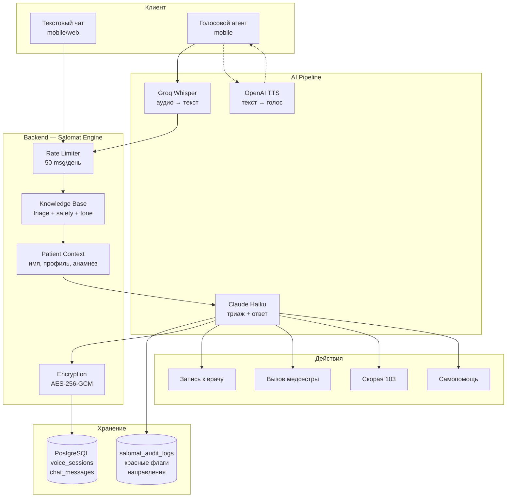
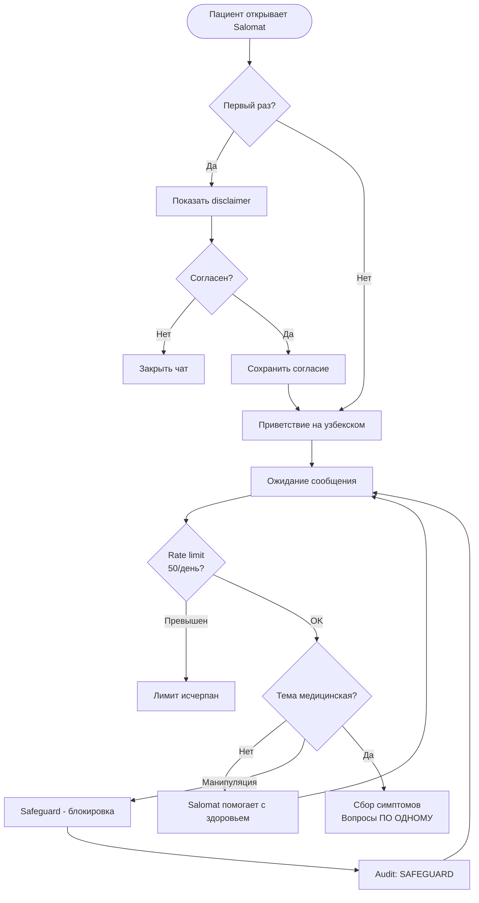
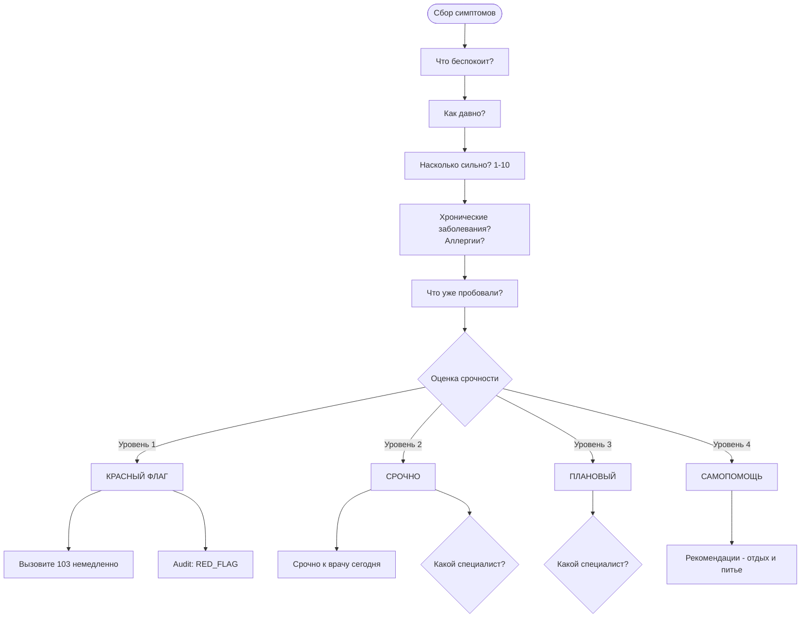
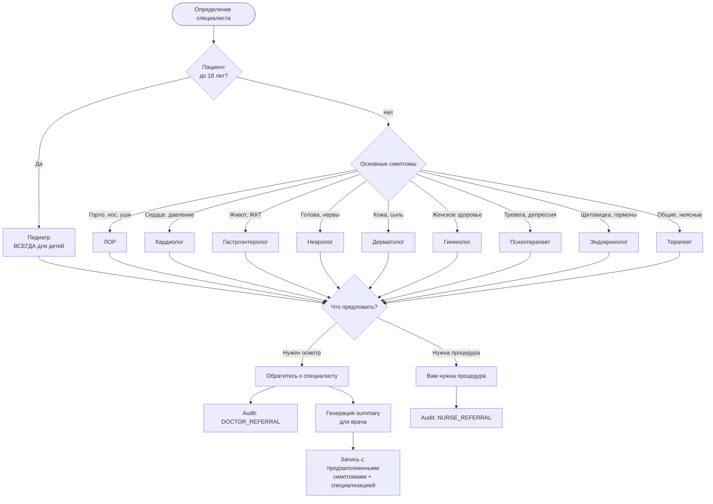
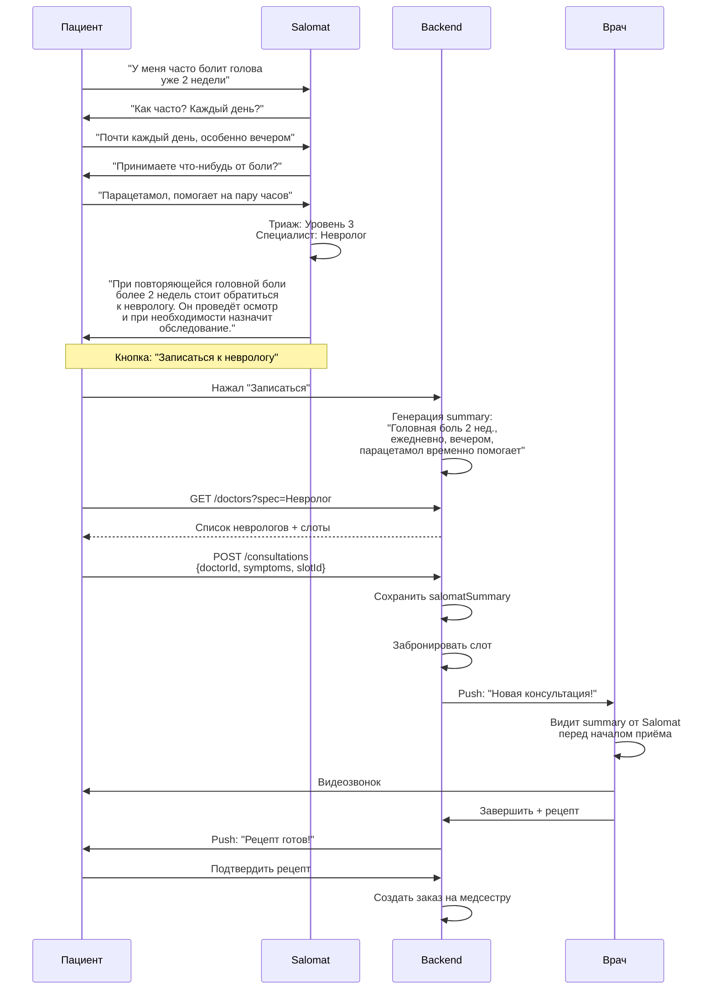
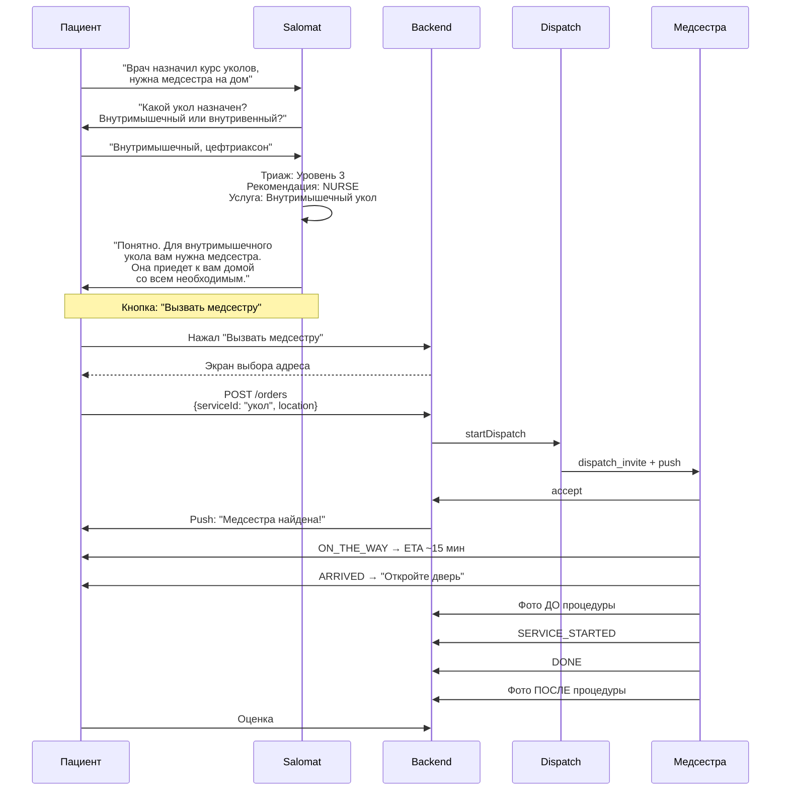
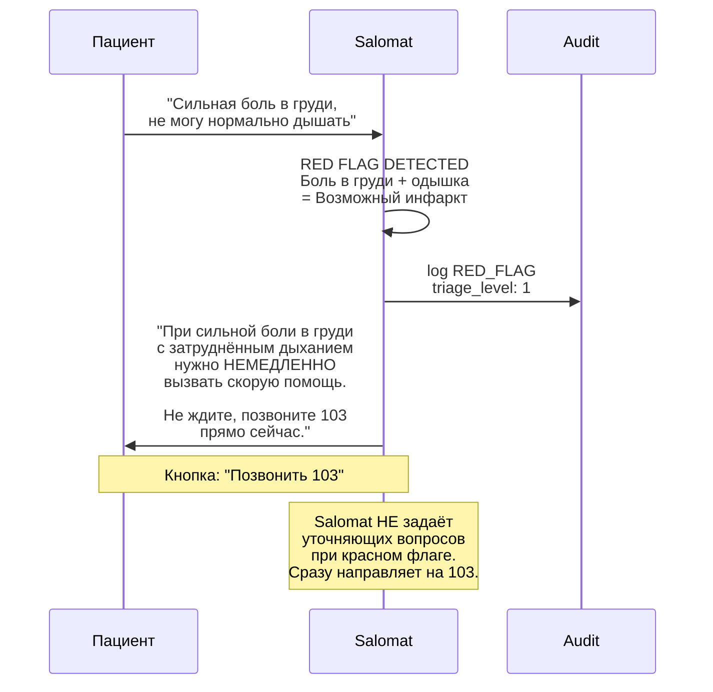
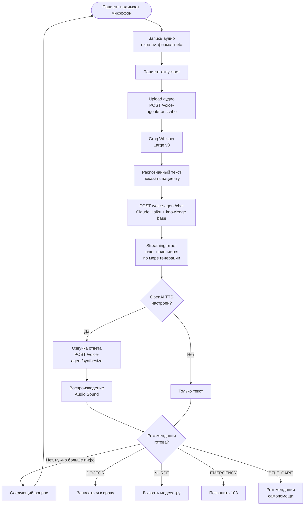
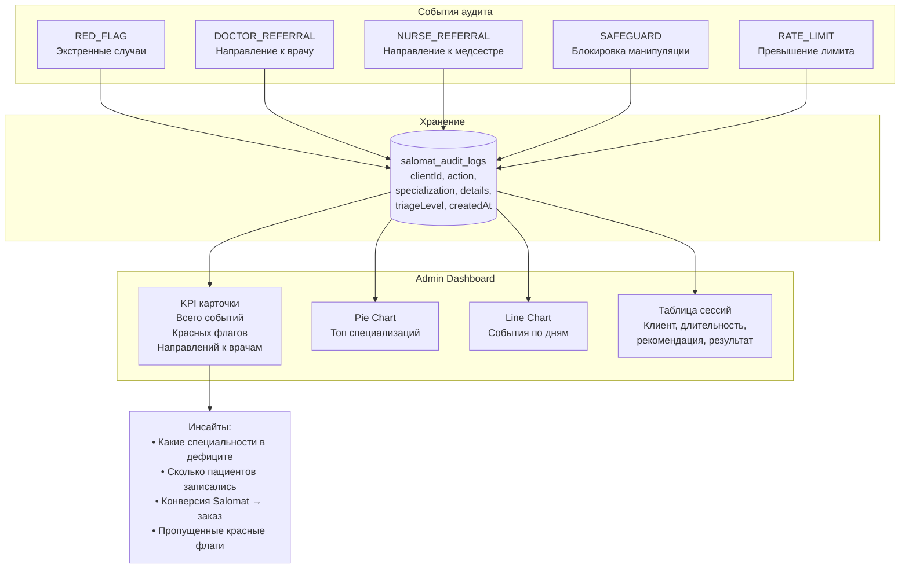
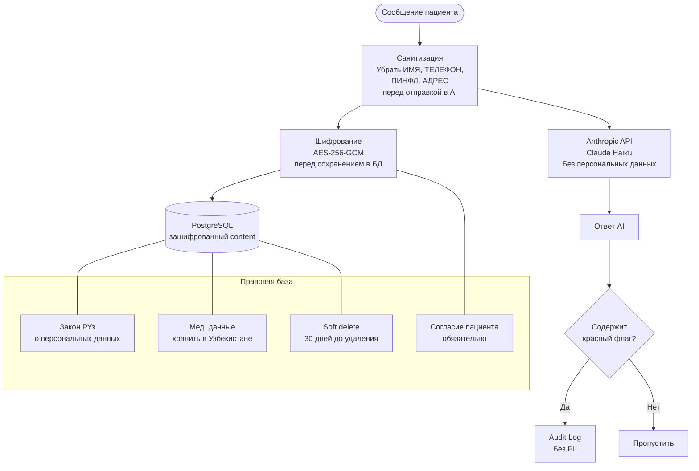

# Salomat — AI Ассистент HamshiraGo

> **Salomat** (от узбекского "соломат" — здоровый) — AI-помощник, который помогает пациентам определить что делать: самолечение, вызвать медсестру или записаться к врачу.

---

## S1. Архитектура Salomat

---

## S2. Полный диалог с Salomat (все сценарии)

---

## S3. Сбор информации и триаж

---

## S4. Направление к специалисту

---

## S5. Salomat → Запись к врачу (полный путь)

---

## S6. Salomat → Вызов медсестры (полный путь)

---

## S7. Salomat → Экстренный случай

---

## S8. Голосовой режим Salomat

---

## S9. Salomat Audit и аналитика

---

## S10. Безопасность и приватность Salomat

