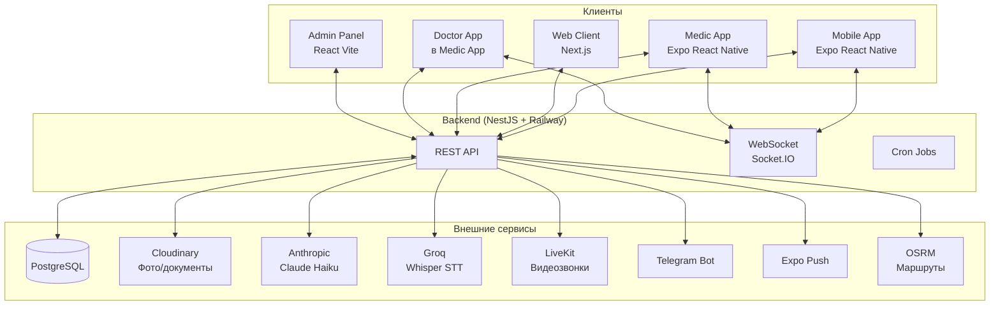
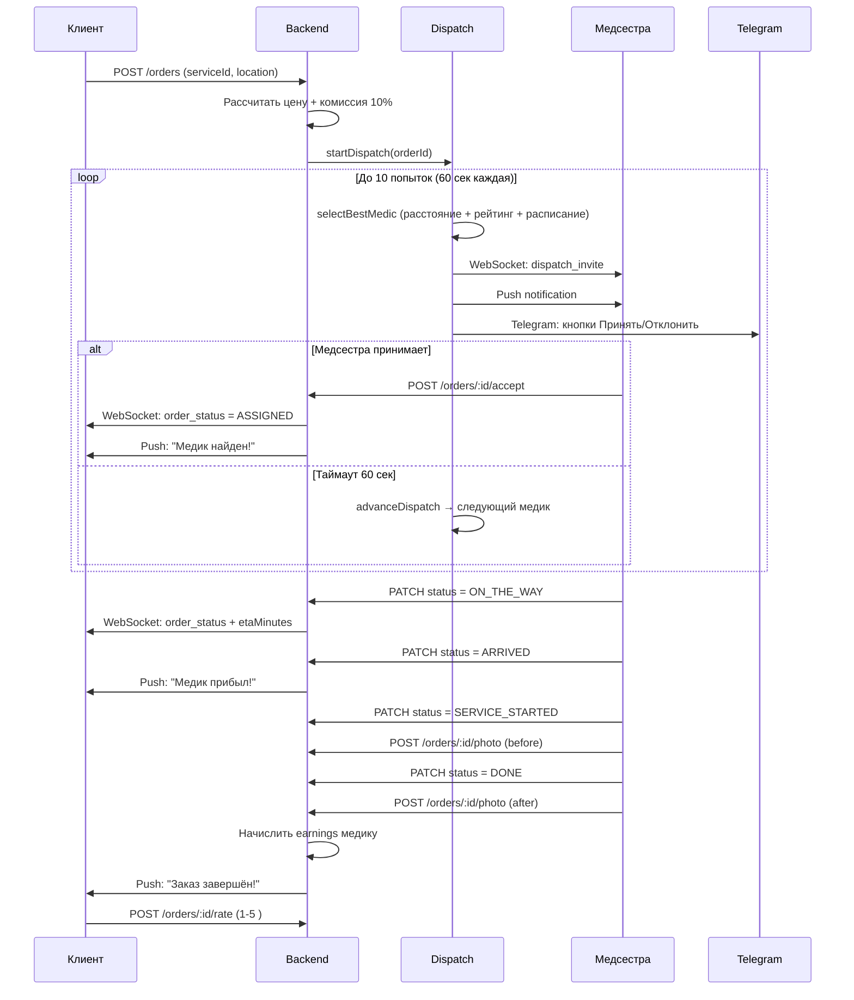
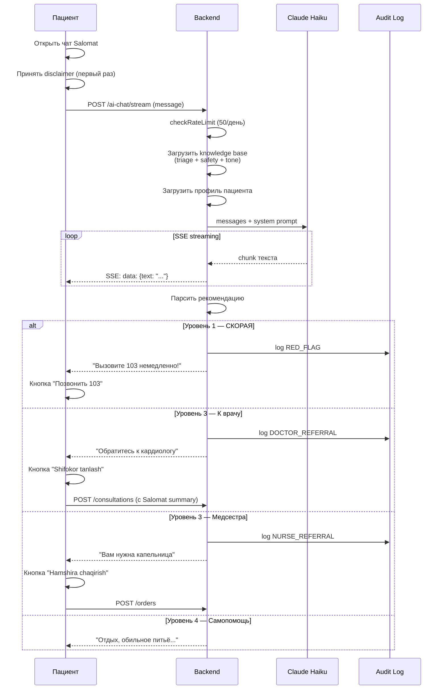
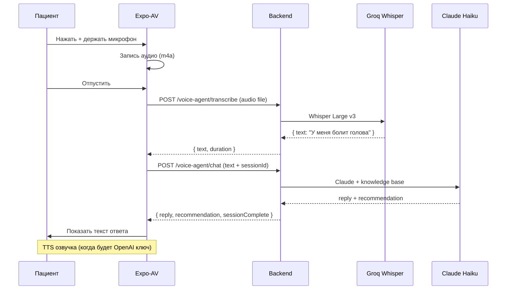
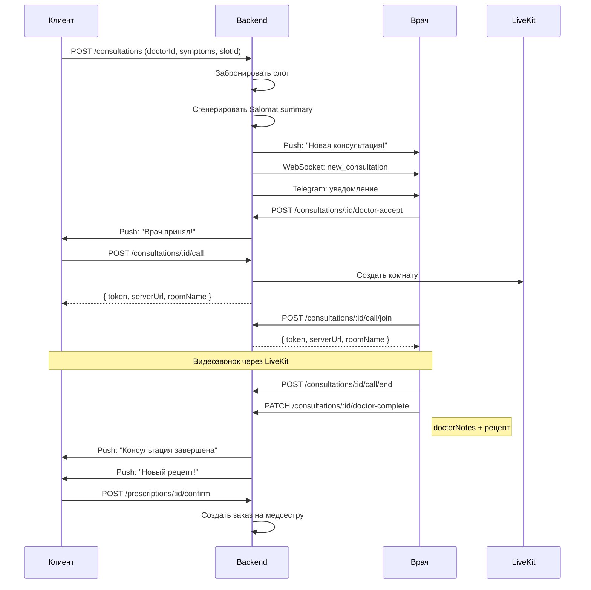
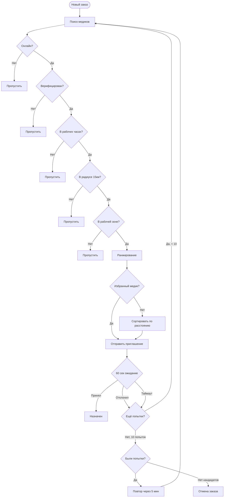
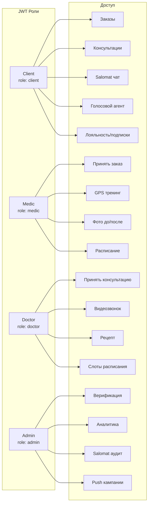
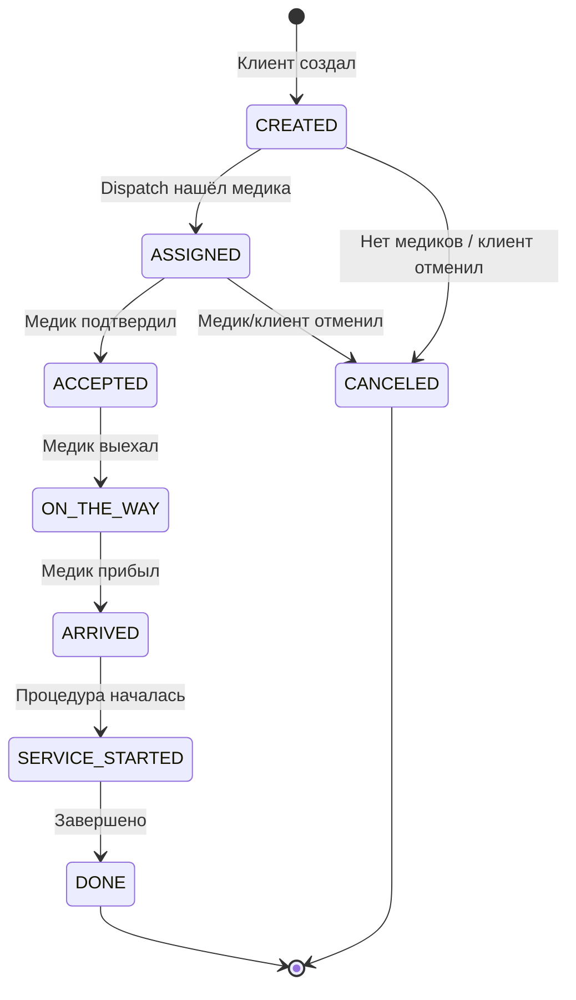
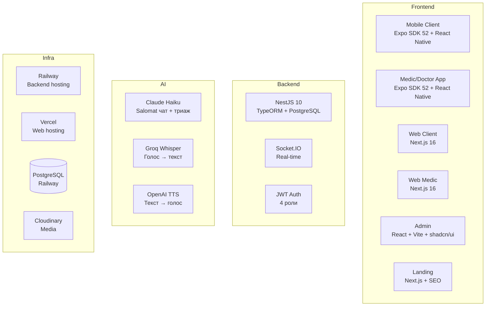
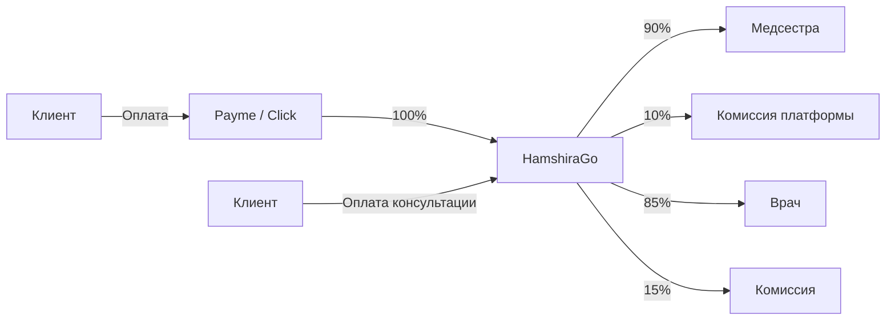

# HamshiraGo — Архитектура и потоки системы

## 1. Общая архитектура

---

## 2. Путь клиента — заказ медсестры

---

## 3. Salomat — AI ассистент

---

## 4. Голосовой агент

---

## 5. Консультация с врачом

---

## 6. Dispatch алгоритм

---

## 7. Роли и доступ

---

## 8. Статусы заказа

---

## 9. Технический стек

---

## 10. Денежный поток

