# HamshiraGo — Архитектура и потоки системы

## 1. Общая архитектура

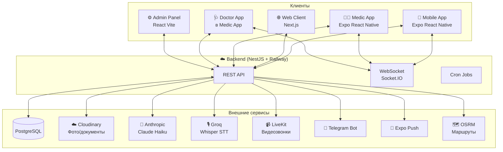

---

## 2. Путь клиента — заказ медсестры

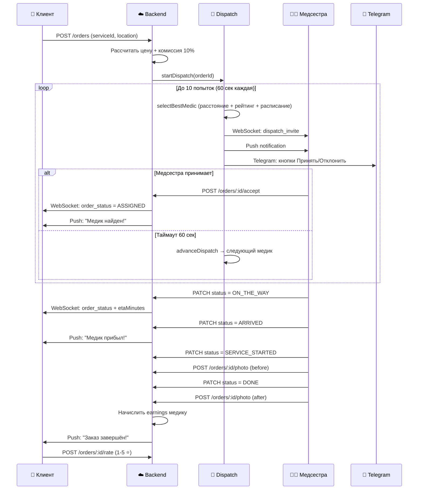

---

## 3. Salomat — AI ассистент

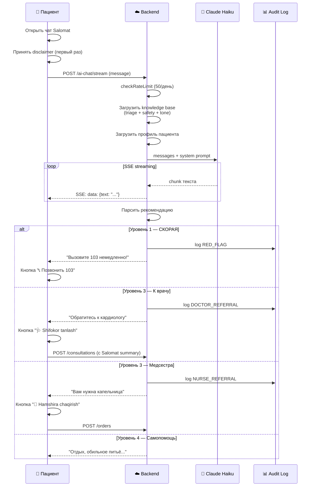

---

## 4. Голосовой агент


---

## 5. Консультация с врачом


---

## 6. Dispatch алгоритм

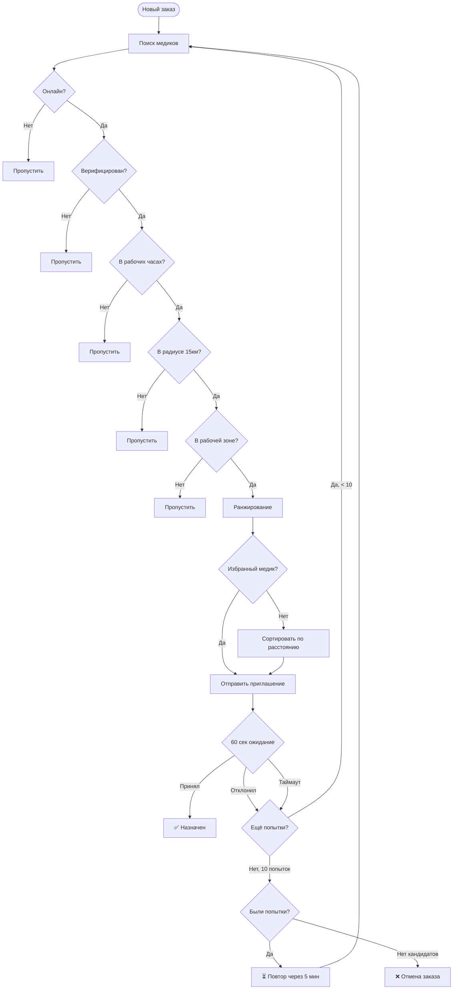

---

## 7. Роли и доступ

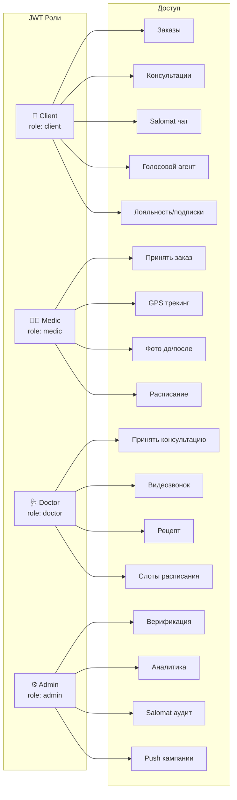

---

## 8. Статусы заказа

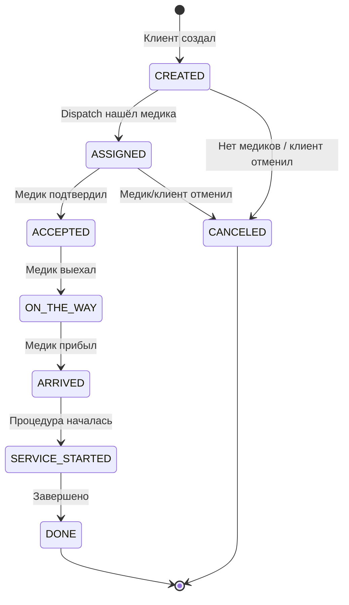

---

## 9. Технический стек

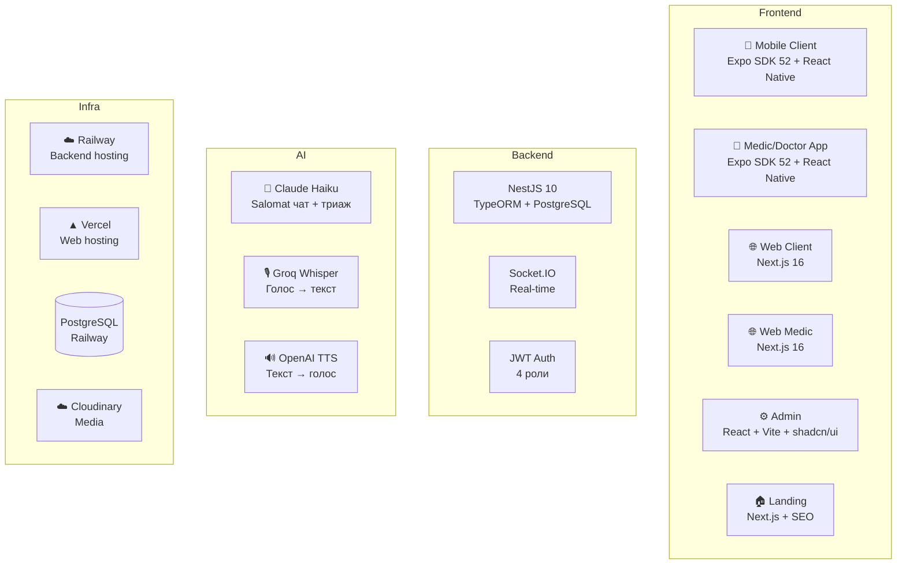

---

## 10. Денежный поток

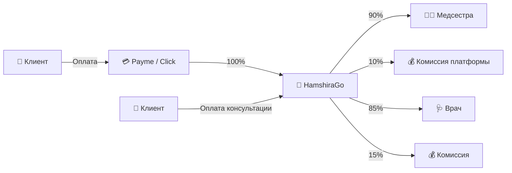

---

# Salomat — AI Ассистент HamshiraGo

> **Salomat** (от узбекского "соломат" — здоровый) — AI-помощник, который помогает пациентам определить что делать: самолечение, вызвать медсестру или записаться к врачу.

---

## S1. Архитектура Salomat

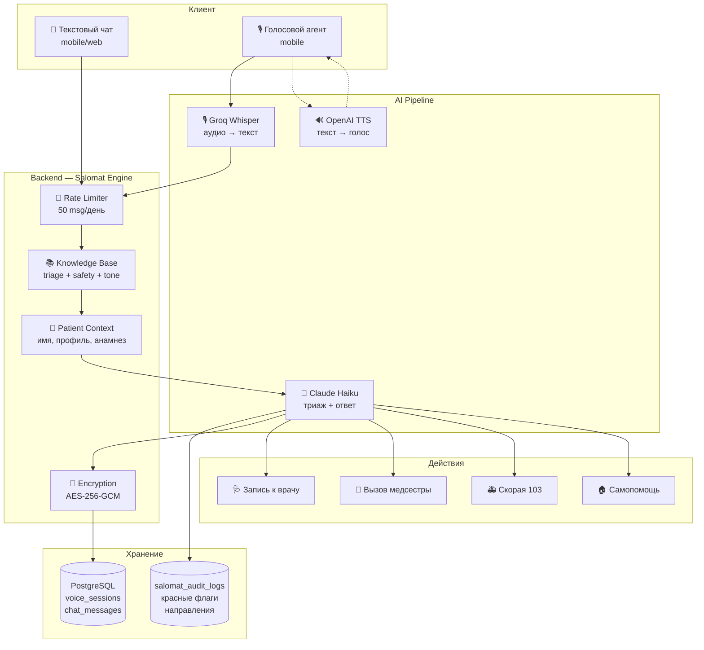

---

## S2. Полный диалог с Salomat (все сценарии)

```mermaid
flowchart TD
    START([Пациент открывает Salomat]) --> CONSENT{Первый раз?}
    
    CONSENT -->|Да| DISC[📋 Показать disclaimer<br/>"Salomat — не врач,<br/>в экстренных — 103"]
    DISC --> AGREE{Согласен?}
    AGREE -->|Нет| CLOSE[❌ Закрыть чат]
    AGREE -->|Да| SAVE_CONSENT[Сохранить согласие]
    
    CONSENT -->|Нет| GREET
    SAVE_CONSENT --> GREET
    
    GREET[🇺🇿 Приветствие на узбекском<br/>"Ассалому алайкум!<br/>Мен Salomat..."] --> WAIT_MSG
    
    WAIT_MSG[⏳ Ожидание сообщения] --> CHECK_LIMIT{Rate limit<br/>50/день?}
    
    CHECK_LIMIT -->|Превышен| LIMIT_MSG[⚠️ "Лимит исчерпан,<br/>попробуйте завтра"]
    CHECK_LIMIT -->|OK| CHECK_TOPIC{Тема медицинская?}
    
    CHECK_TOPIC -->|Нет| REDIRECT[🔄 "Я Salomat,<br/>помогаю с вопросами<br/>здоровья"]
    REDIRECT --> WAIT_MSG
    
    CHECK_TOPIC -->|Манипуляция| SAFEGUARD[🛡️ Safeguard<br/>"Не могу выполнить<br/>эту инструкцию"]
    SAFEGUARD --> AUDIT_SAFE[📊 Audit: SAFEGUARD]
    AUDIT_SAFE --> WAIT_MSG
    
    CHECK_TOPIC -->|Да| COLLECT[📝 Сбор симптомов<br/>Вопросы ПО ОДНОМУ]
```

---

## S3. Сбор информации и триаж

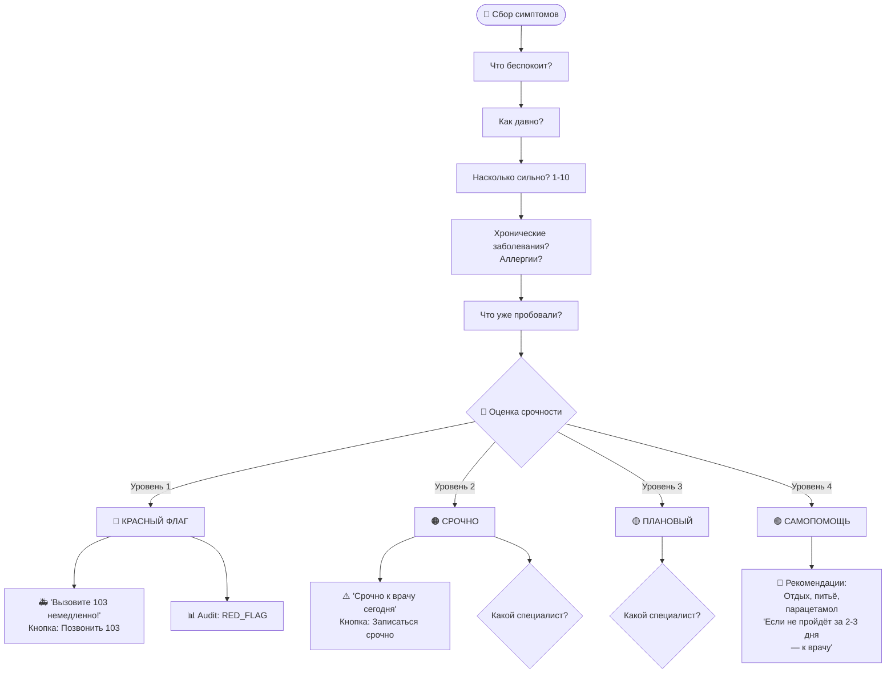

---

## S4. Направление к специалисту

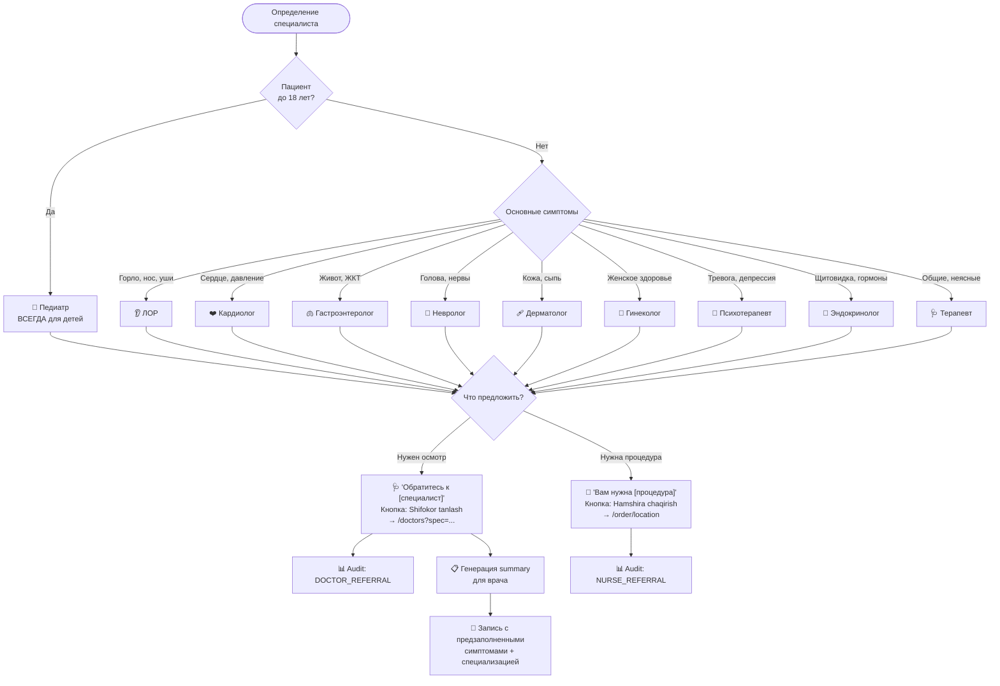

---

## S5. Salomat → Запись к врачу (полный путь)

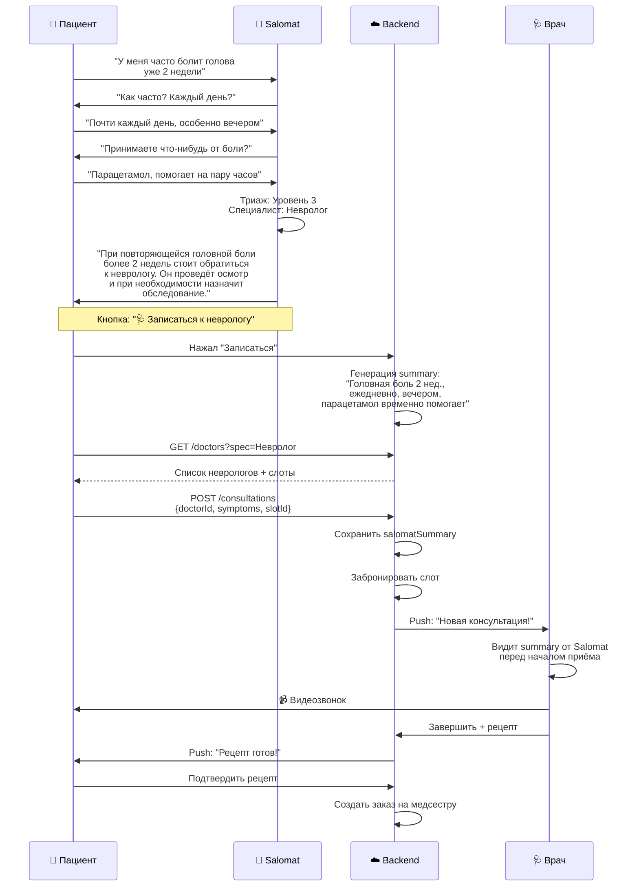

---

## S6. Salomat → Вызов медсестры (полный путь)

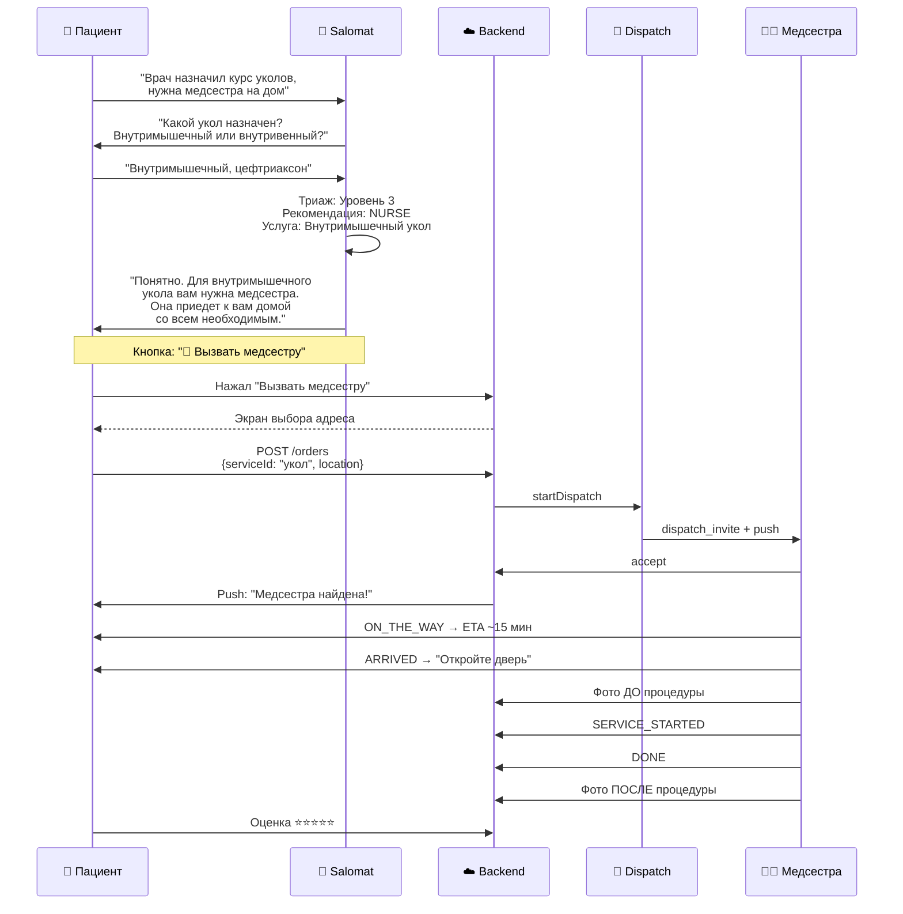

---

## S7. Salomat → Экстренный случай

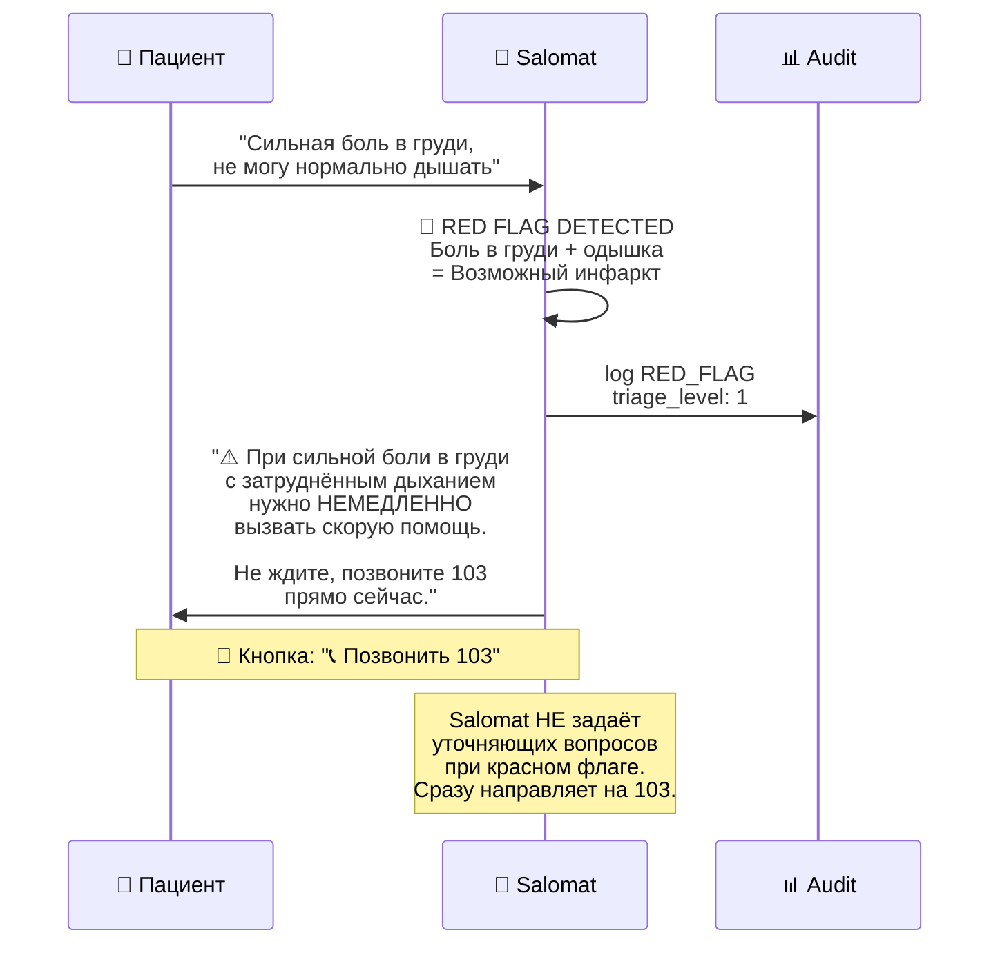

---

## S8. Голосовой режим Salomat

```mermaid
flowchart TD
    START([🎙️ Пациент нажимает микрофон]) --> REC[🔴 Запись аудио<br/>expo-av, формат m4a]
    
    REC --> RELEASE[Пациент отпускает]
    RELEASE --> UPLOAD[📤 Upload аудио<br/>POST /voice-agent/transcribe]
    
    UPLOAD --> STT[🎙️ Groq Whisper<br/>Large v3]
    STT --> TEXT[📝 Распознанный текст<br/>показать пациенту]
    
    TEXT --> CHAT[🤖 POST /voice-agent/chat<br/>Claude Haiku + knowledge base]
    
    CHAT --> STREAM[📨 Streaming ответ<br/>текст появляется<br/>по мере генерации]
    
    STREAM --> TTS_CHECK{OpenAI TTS<br/>настроен?}
    
    TTS_CHECK -->|Да| TTS[🔊 Озвучка ответа<br/>POST /voice-agent/synthesize]
    TTS --> PLAY[🔈 Воспроизведение<br/>Audio.Sound]
    
    TTS_CHECK -->|Нет| TEXT_ONLY[📝 Только текст]
    
    PLAY --> DONE_CHECK{Рекомендация<br/>готова?}
    TEXT_ONLY --> DONE_CHECK
    
    DONE_CHECK -->|Нет, нужно больше инфо| NEXT_Q[Следующий вопрос]
    NEXT_Q --> START
    
    DONE_CHECK -->|DOCTOR| DOC_CARD[🩺 Карточка<br/>"Записаться к врачу"]
    DONE_CHECK -->|NURSE| NURSE_CARD[💉 Карточка<br/>"Вызвать медсестру"]
    DONE_CHECK -->|EMERGENCY| EMRG_CARD[🚑 Карточка<br/>"Позвонить 103"]
    DONE_CHECK -->|SELF_CARE| TIPS[💊 Рекомендации<br/>самопомощи]
```

---

## S9. Salomat Audit и аналитика

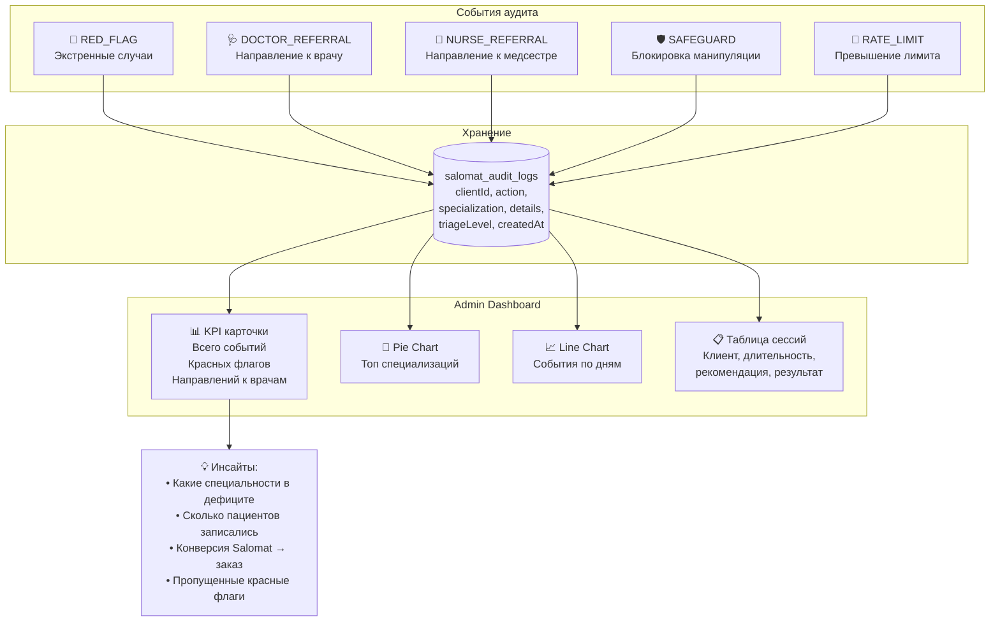

---

## S10. Безопасность и приватность Salomat

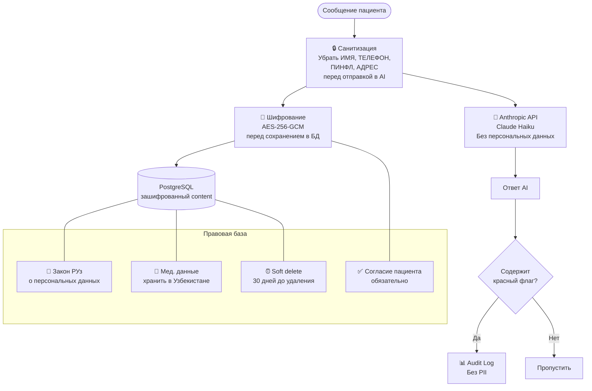
